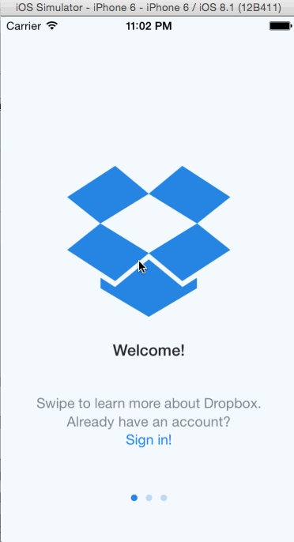

# Dropbox-Demo
Week 1 assignment Dropbox prototype

This assignment is to create a prototype of Drobox by implementing the following flows:

* [x] Required: Create account
* [x] Required: Sign-in
* [x] Required: Logout
* [x] Required: Select each tab and view contents
* [x] Required: Scroll through settings tab
* [x] Required: Tap through welcome screens

Total hours spent : 6 hours

GIF created with [LiceCap](http://www.cockos.com/licecap/).
